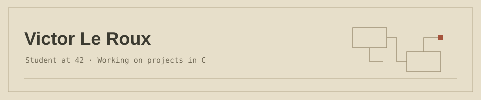

Interested in Linux, Wayland and how graphics are rendered.

## Projects

### [Xway-Lib](https://github.com/RevoIDE/Xway-lib)

A C11 library in development for native Wayland windows,
software framebuffer drawing and input handling

### [CPU-voxel-engine](https://github.com/RevoIDE/CPU-voxel-engine)

A voxel engine project in C exploring CPU rendering,
rasterization and 3D mathematics.
